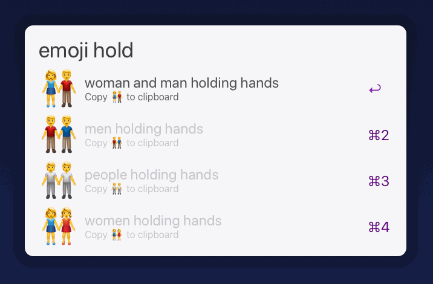

# Alfred Emoji Picker

1. Install the latest version of this extension from the Releases page.
2. Type `emoji [thing you want to find]`

## Skin tone modifier support

By default, emoji that support skin tone (fitzpatrick) modifiers will default to no modifier. To pick an emoji with fitzpatrick modifier, add `-t[1-5]` to the end of your query. For emoji that accept more than one fitzpatrick modifier, you can specify multiple digits:

